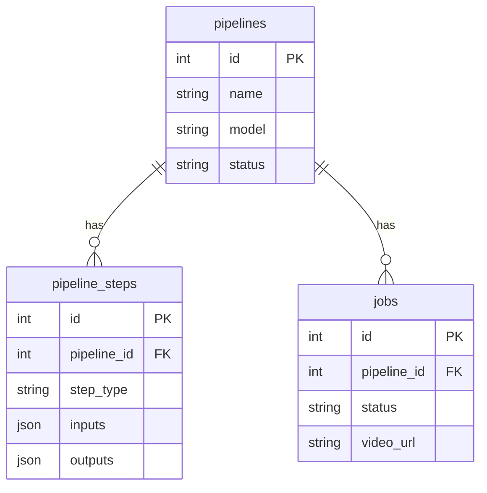

# Database Schema

## Overview

i2v uses SQLite for data persistence with SQLAlchemy ORM.

## Tables

### pipelines

| Column | Type | Description |
|--------|------|-------------|
| id | INTEGER | Primary key |
| name | VARCHAR | Pipeline name |
| model | VARCHAR | Model identifier |
| status | VARCHAR | Pipeline status |
| created_at | DATETIME | Creation timestamp |
| updated_at | DATETIME | Last update |

### pipeline_steps

| Column | Type | Description |
|--------|------|-------------|
| id | INTEGER | Primary key |
| pipeline_id | INTEGER | FK to pipelines |
| step_type | VARCHAR | Step type |
| inputs | JSON | Step inputs |
| outputs | JSON | Step outputs |
| status | VARCHAR | Step status |

### jobs

| Column | Type | Description |
|--------|------|-------------|
| id | INTEGER | Primary key |
| pipeline_id | INTEGER | FK to pipelines |
| model | VARCHAR | Model used |
| status | VARCHAR | Job status |
| request_id | VARCHAR | Fal.ai request ID |
| video_url | VARCHAR | Output video URL |
| error_message | TEXT | Error if failed |

### upload_cache

| Column | Type | Description |
|--------|------|-------------|
| id | INTEGER | Primary key |
| original_url | VARCHAR | Source URL |
| fal_url | VARCHAR | Fal CDN URL |
| created_at | DATETIME | Cache timestamp |

## Entity Relationships

