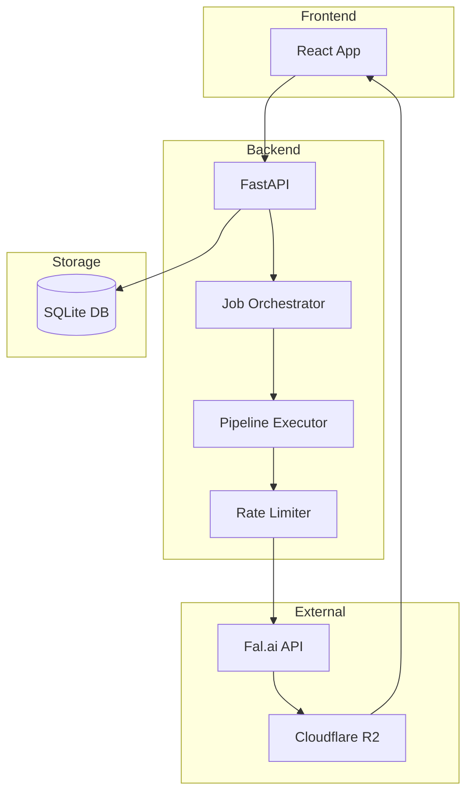

# Architecture Overview

## System Architecture

## Components

### Frontend (React + TypeScript)

- Job management UI
- Pipeline creation
- Real-time status updates

### Backend (FastAPI)

- RESTful API endpoints
- Async job processing
- Database management

### Services

- **Job Orchestrator**: Manages job lifecycle
- **Pipeline Executor**: Runs generation steps
- **Rate Limiter**: Prevents API quota exhaustion
- **R2 Cache**: CDN caching for outputs

## Data Flow

1. User creates pipeline via frontend
2. Backend stores pipeline in SQLite
3. User triggers pipeline run
4. Job Orchestrator queues the job
5. Pipeline Executor calls Fal.ai
6. Results cached to R2 CDN
7. Frontend displays completed video
