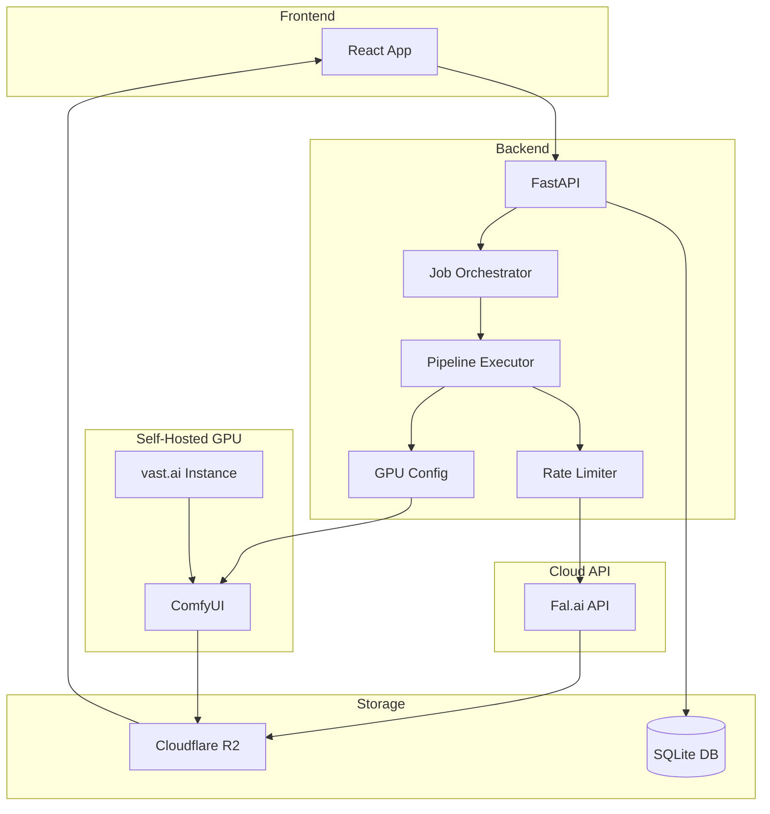

# Architecture Overview

## System Architecture



## Components

### Frontend (React + TypeScript)

- Job management UI
- Pipeline creation
- Real-time status updates

### Backend (FastAPI)

- RESTful API endpoints
- Async job processing
- Database management

### Services

- **Job Orchestrator**: Manages job lifecycle
- **Pipeline Executor**: Runs generation steps
- **Rate Limiter**: Prevents API quota exhaustion
- **R2 Cache**: CDN caching for outputs

## Data Flow

### Cloud Generation (Fal.ai)

1. User creates pipeline via frontend
2. Backend stores pipeline in SQLite
3. User triggers pipeline run
4. Job Orchestrator queues the job
5. Pipeline Executor calls Fal.ai
6. Results cached to R2 CDN
7. Frontend displays completed video

### Self-Hosted GPU Generation (vast.ai)

1. User selects "Wan 2.2 (GPU)" model in frontend
2. Frontend calls `/api/vastai/generate-video`
3. Backend checks runtime GPU config (set via `/api/gpu/config`)
4. If configured, uses tunnel URL to access ComfyUI on vast.ai
5. ComfyUI executes Wan 2.2 I2V workflow with LightX2V LoRA
6. Generated video cached to R2
7. Video URL returned to frontend

**Note:** vast.ai instances use Cloudflare tunnels for access. The tunnel URL must be manually obtained from the vast.ai console and configured via the GPU config API. See [GPU Setup Guide](../GPU_SETUP.md) for details.

## GPU Integration Architecture

The platform supports self-hosted GPU video generation on vast.ai:

```
┌─────────────────────────────────────────────────────────────────┐
│                     GPU Config System                            │
├─────────────────────────────────────────────────────────────────┤
│                                                                  │
│   /api/gpu/config                                                │
│       │                                                          │
│       ├── comfyui_url: Tunnel URL from vast.ai console          │
│       ├── swarmui_url: SwarmUI URL (if using SwarmUI)           │
│       ├── gpu_provider: "none" | "local" | "vastai"             │
│       └── vastai_instance_id: Active instance ID                │
│                                                                  │
│   Runtime Config (in-memory)                                    │
│       │                                                          │
│       └── Used by /api/vastai/generate-video                    │
│           and /api/swarm/generate-video endpoints               │
│                                                                  │
└─────────────────────────────────────────────────────────────────┘
```

### Key Files

| File | Purpose |
|------|---------|
| `app/routers/gpu_config.py` | Runtime GPU URL configuration API |
| `app/routers/vastai.py` | vast.ai instance management and video generation |
| `app/routers/swarmui.py` | SwarmUI-specific endpoints |
| `app/services/vastai_client.py` | vast.ai API client |
| `app/services/swarmui_client.py` | SwarmUI API client |
| `app/services/comfyui_workflows.py` | ComfyUI workflow definitions |

### Supported Models

| Model | Backend | Notes |
|-------|---------|-------|
| Wan 2.2 (GPU) | ComfyUI on vast.ai | Self-hosted, ~$0.34/hr |
| Wan 2.5 | Fal.ai | Cloud, pay-per-gen |
| Kling | Fal.ai | Cloud, pay-per-gen |
| Veo 2 | Fal.ai | Cloud, pay-per-gen |
