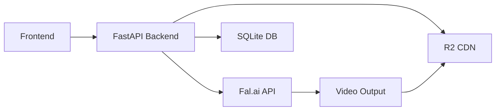

# i2v - Image to Video Pipeline

A FastAPI-based pipeline for generating AI videos from images using Fal.ai models.

## Features

- **Multi-Model Support**: WAN 2.1, Hunyuan, Kling, and more
- **Pipeline Management**: Create and manage video generation workflows
- **Job Tracking**: Real-time status updates and progress monitoring
- **R2 CDN Caching**: Fast delivery via Cloudflare R2
- **Bulk Processing**: Generate multiple videos in parallel

## Quick Start

```bash
# Clone and install
git clone https://github.com/your-repo/i2v.git
cd i2v
pip install -r requirements.txt

# Configure environment
cp .env.example .env
# Edit .env with your API keys

# Start the server
uvicorn app.main:app --port 8001

# Start frontend
cd frontend && npm install && npm run dev
```

## Architecture



## API Endpoints

| Endpoint | Method | Description |
|----------|--------|-------------|
| `/pipelines` | GET | List all pipelines |
| `/pipelines` | POST | Create new pipeline |
| `/pipelines/{id}/run` | POST | Execute pipeline |
| `/jobs` | GET | List all jobs |
| `/jobs/{id}` | GET | Get job status |

## Configuration

Key environment variables:

| Variable | Description |
|----------|-------------|
| `FAL_KEY` | Fal.ai API key |
| `R2_ACCESS_KEY_ID` | Cloudflare R2 access key |
| `R2_SECRET_ACCESS_KEY` | R2 secret key |
| `R2_BUCKET_NAME` | R2 bucket name |
| `R2_PUBLIC_DOMAIN` | R2 public URL domain |
